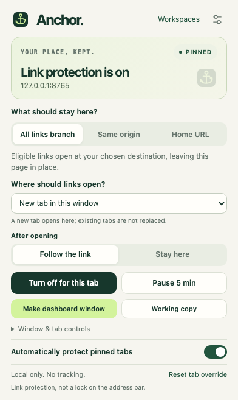
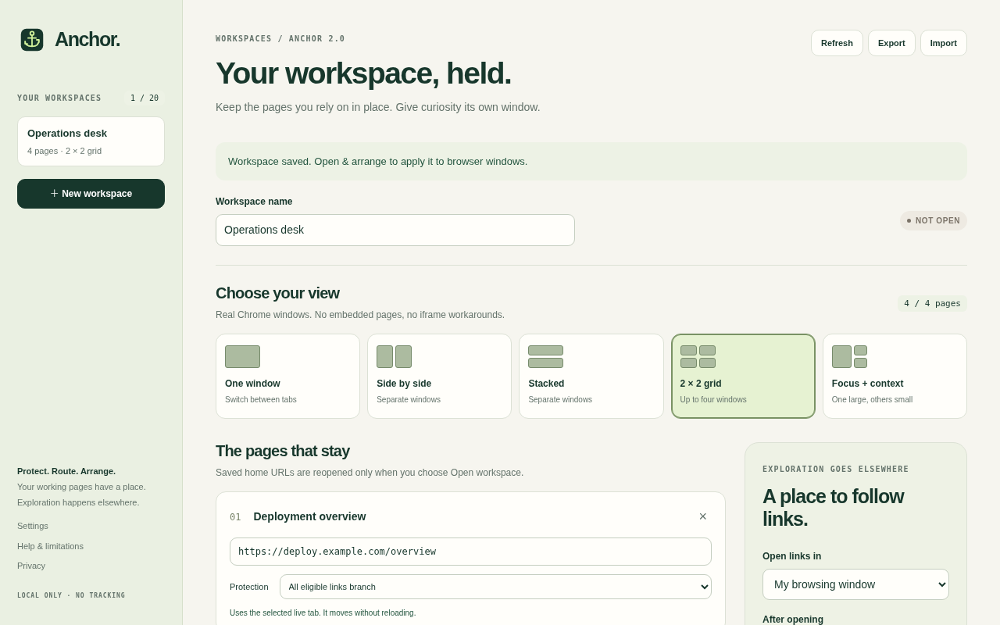
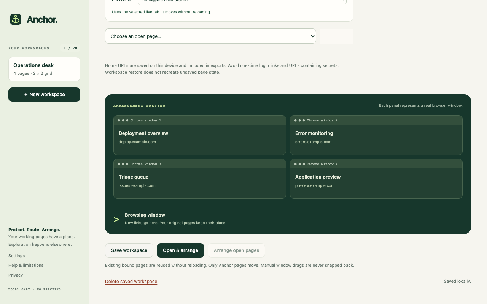

# Anchor — pinned tab protection and workspaces

**Keep your place. Explore somewhere else.**

Anchor is a Chrome extension that protects **pinned tabs from link navigation**. When you follow an eligible link, Anchor opens the destination elsewhere so your pinned page keeps its place.

Start with a pinned tab, then choose how much of your browser to organize:

- **Protect a page:** automatically protect pinned tabs, or manually protect any working tab.
- **Separate exploration:** open links in a new tab, a new window, or a designated browsing window; choose whether to follow them or stay on the original page.
- **Build a workspace:** save up to four protected pages, arrange their Chrome windows, and send new browsing outside the dashboard windows.

Chrome’s own Pin command keeps a tab handy but still lets it navigate. Anchor adds protection for eligible links. Address-bar changes and some other navigation paths remain outside that protection; see [URL protection](#what-to-expect-from-url-protection).

No account or subscription. Settings stay on your device. No analytics or Anchor backend.



*Anchor’s popup. Screenshots use sample pages and local browser API fixtures; they show the interface, not a live customer dashboard.*

## Install in Chrome

This repository includes an unpacked **2.0.0 beta** for Chrome 123 or later. A Chrome Web Store installation link is not available yet.

1. [Download the repository ZIP](https://github.com/mattrichmo/anchor/archive/refs/heads/main.zip) and extract it into a folder you’ll keep. If you already cloned the repository, use that folder.
2. Open `chrome://extensions` and turn on **Developer mode**.
3. Click **Load unpacked** and select the **`extension`** folder inside the extracted repository. Select the folder containing `manifest.json`.
4. Refresh webpages that were already open. Disable any older Anchor copy so only one is active.
5. Open a normal webpage, right-click its Chrome tab, and select **Pin**. Click Anchor’s toolbar icon and look for **Link protection is on**.

You can pin Anchor’s toolbar icon through Chrome’s puzzle-piece menu to make it easier to find. Protecting a page requires pinning the **webpage tab**, or choosing **Protect this tab** in Anchor’s popup.

The included extension works without installing Node, Python, or other development tools. Keep its folder in place: Chrome loads the unpacked extension from there.

## Try it on one page

Open a dashboard or project page you want to keep. Pin its tab, confirm protection in the popup, then click an ordinary link. By default, an eligible link opens in a new tab in the same window.

Choose **Where should links open?** to change that behavior:

| Choice | What happens |
| --- | --- |
| New tab in this window | Each eligible link opens in a new tab beside your working page. |
| New tab in my browsing window | Links collect in a separate browsing window. Anchor creates one when needed. |
| A new window for each link | Each eligible link gets its own Chrome window. |

Choose **Stay here** to keep working on the dashboard, or **Follow the link** to switch to the destination. To use an existing browsing window, open Anchor on a webpage in that window and select **Window & tab controls → Use this window for browsing links**.

Want a dedicated dashboard window? Choose **Make dashboard window**. Anchor moves the current page into its own window when necessary, protects it, and saves a solo workspace. Links go to a browsing window while you stay on the dashboard.

### Choose which links stay on the page

| Mode | Use it when… |
| --- | --- |
| All links branch | You want eligible links to open elsewhere. This is the default. |
| Same origin | You want links within the same protocol, host, and port to stay here; other links open elsewhere. |
| Home URL | You want only the exact saved home address to stay here. Choose **Use this page as home** to update it. |

Same-page section links stay on the page by default. Settings offers optional handling for hash links and simple GET forms, plus site rules for exceptions.

## Arrange a workspace

A workspace saves one to four pages and their layout. You can save up to 20 workspaces.

1. Open **Workspaces** from the popup and give your workspace a name.
2. Add pages from **Choose an open page**, or add their home URLs. Selecting open pages lets Anchor move those live tabs without deliberately reloading them.
3. Choose **One window**, **Side by side**, **Stacked**, **2 × 2 grid**, or **Focus + context**.
4. Choose a browsing destination and whether to follow links or stay on the dashboards.
5. Click **Open & arrange**.



*The workspace editor with four sample pages.*



*The arrangement preview is an illustration. A grid opens four real Chrome windows; One window keeps several tabs together, with one visible at a time.*

**Save workspace** saves your choices without moving windows. **Open & arrange** applies them and opens saved URLs for missing pages. **Arrange open pages** rearranges the currently bound pages without reopening closed ones. Saved workspaces stay available after restarting Chrome; live bindings can be lost, so opening a workspace may create fresh pages.

With **Reserve dashboard windows** enabled, Anchor also moves supported newly created extra tabs out of dashboard windows. This helps with Ctrl/Cmd-click, middle-click, and new-tab links. A tab may briefly appear before moving. Sign-in pages and browser-owned tabs may stay where Chrome opened them.

Use **Display & spacing** to adjust the layout. **Choose another display** requests permission to read monitor information. Small screens may require fewer pages or the One window layout; Chrome and your operating system may adjust window sizes and focus.

## Pause, return, and back up

- **Pause 5 min** lets navigation stay in the current tab while you sign in or maintain a page. Protection resumes automatically; **Resume now** ends the pause early.
- **Return to original anchor** switches from a routed tab back to its source, if that source is still open.
- **Working copy** opens the current address separately. Unsaved edits and application memory are not copied.
- **Release workspace** leaves pages open and restores their earlier protection choices. A pinned page may still be protected automatically.
- Export preferences from **Settings → Your data**, and workspace definitions from **Workspaces**. These are separate JSON files. Review saved URLs for private paths or tokens before sharing them.

## Troubleshooting

| What you see | What to try |
| --- | --- |
| A connection warning or `!` badge | Allow Anchor’s site access in Chrome’s extension controls, then choose **Reconnect this page**. Refresh the webpage if needed. |
| A pinned page is unprotected | Confirm you pinned the webpage tab. Check that Anchor is enabled, automatic pinned-tab protection is on, and the site has no exclusion rule. |
| A login or application control behaves unexpectedly | Pause protection before using it. Some sites depend on navigation in the original tab. |
| Links switch you away from the dashboard | Select **Stay here** in the popup. Workspace pages use the workspace’s focus setting. |
| A new tab remains in a dashboard window | Sign-in/browser-owned tabs and uncertain moves are left open. Check the workspace notice and browsing destination. |
| Recovery works once, then stops | Recovery disarms after one attempt. Check the current page, then choose **Enable recovery again** in the popup. |
| A workspace cannot fit on the display | Choose fewer pages, a larger display, or **One window**. |
| An interrupted-operation notice appears | Check all open windows before allowing a retry. An earlier request may already have created a page. |
| Chrome refuses Load unpacked | Your browser or organization may restrict extension installation. Use a browser profile where unpacked extensions are permitted. |

## What to expect from URL protection

Anchor protects eligible ordinary link clicks. Address-bar edits, Back/Forward, reloads, redirects, and JavaScript-only navigation can still change a working page. An `ON` badge confirms the page’s link guard is connected; it does not mean every navigation is blocked. After pinning a page, wait for connected protection before following links.

**Navigation recovery** is experimental and off by default in Settings. It can open an eligible address-bar, bookmark, missed link, or start-page destination separately and reload the previous URL. That happens after navigation starts: unsaved work may already be lost. Recovery stops after one attempt per tab until you enable it again. Forms, redirects, Back/Forward, reloads, and same-page SPA changes are excluded.

Downloads, links that already target another tab, modifier clicks, protocol links such as `mailto:`, and POST/password/file forms keep their browser behavior. Simple GET-form protection is optional. Chrome internal pages, the Chrome Web Store, and incognito are unsupported.

## Privacy and permissions

Preferences and saved workspaces are stored locally. Temporary session storage holds live page/window bindings and limited navigation context. Anchor does not send this information to its developer; sites you visit receive normal browser requests.

HTTP/HTTPS site access lets Anchor protect links on the pages you choose. Other permissions support local storage, page reconnection, menus, timed pauses, and navigation observation. Optional monitor access is used for workspace arrangement. Anchor does not read your cookie or password stores, record screens, or load remote runtime scripts.

Read the [privacy notes](docs/PRIVACY.md) and [permission details](store/PRIVACY-AND-PERMISSIONS.md).

## Update an unpacked installation

Export preferences and workspaces first. Replace the contents of the **same extension folder** you originally loaded, click **Reload** in `chrome://extensions`, and refresh open webpages. Using the same folder helps preserve the extension’s identity and settings.

Loading a different folder may create a separate installation. Disable the old copy and import your backups into the new one. Reloading or restarting can invalidate live workspace bindings; save any unsaved work before reopening saved pages.

## For contributors

Source files live in `src/` and `public/`; the build copies them to `extension/`. Edit source files and rebuild rather than editing only the generated extension. Node 20+ and Python 3.10+ are development tools.

```sh
npm run check
python -m pip install -r tests/e2e/requirements.txt
python -m playwright install chromium
npm run test:ui
npm run test:e2e
```

`npm run check` runs unit tests, builds the extension, and validates its manifest and assets. UI tests render the real interface with mocked Chrome APIs. Installed-extension E2E is a separate check; exit code 2 means startup was unavailable, not a pass. `CHROME_BIN` can select a permitted Chromium executable.

Installed-extension acceptance remains open in this managed environment because the extension service worker does not load. Real Chrome, operating-system window arrangement, and real-dashboard checks are still needed. See the [test report](docs/TEST-REPORT.md) and [manual acceptance checklist](docs/MANUAL-ACCEPTANCE.md).

For local navigation fixtures, run `npm run demo`. For packaging, run `npm run package`; store submission is a separate step.

Questions or reproducible issues: [hello@mattrichmond.ca](mailto:hello@mattrichmond.ca). Include your Anchor version, Chrome version, operating system, and redacted steps. Keep credentials and confidential URLs out of reports.
